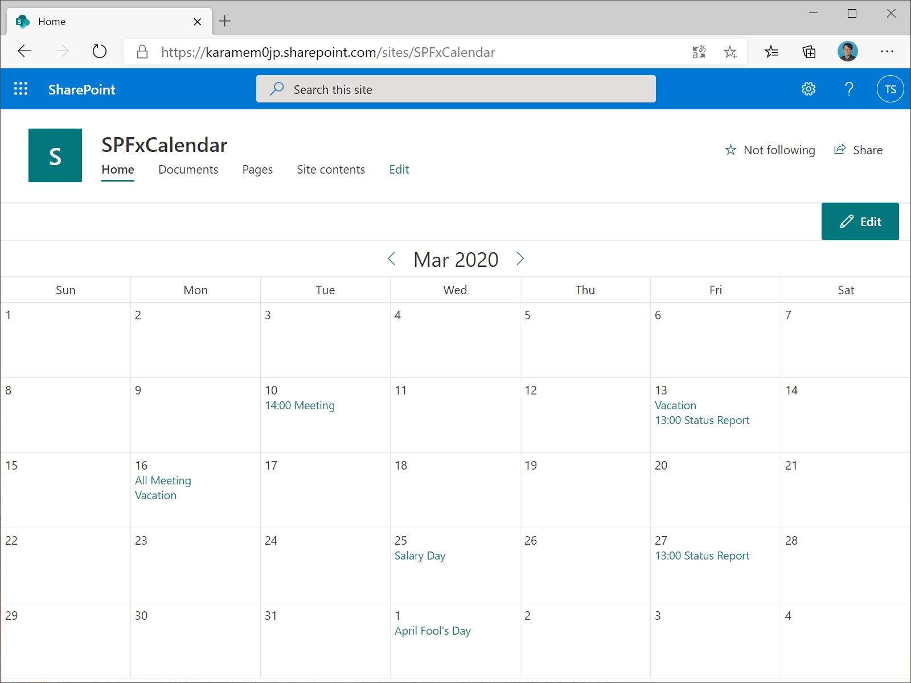
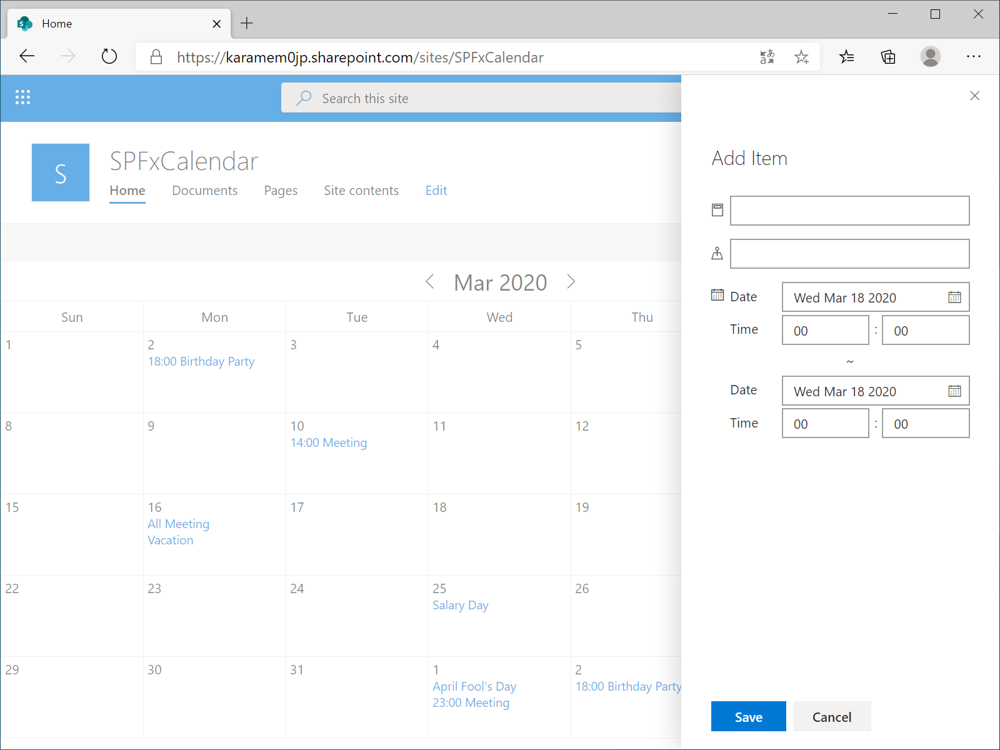
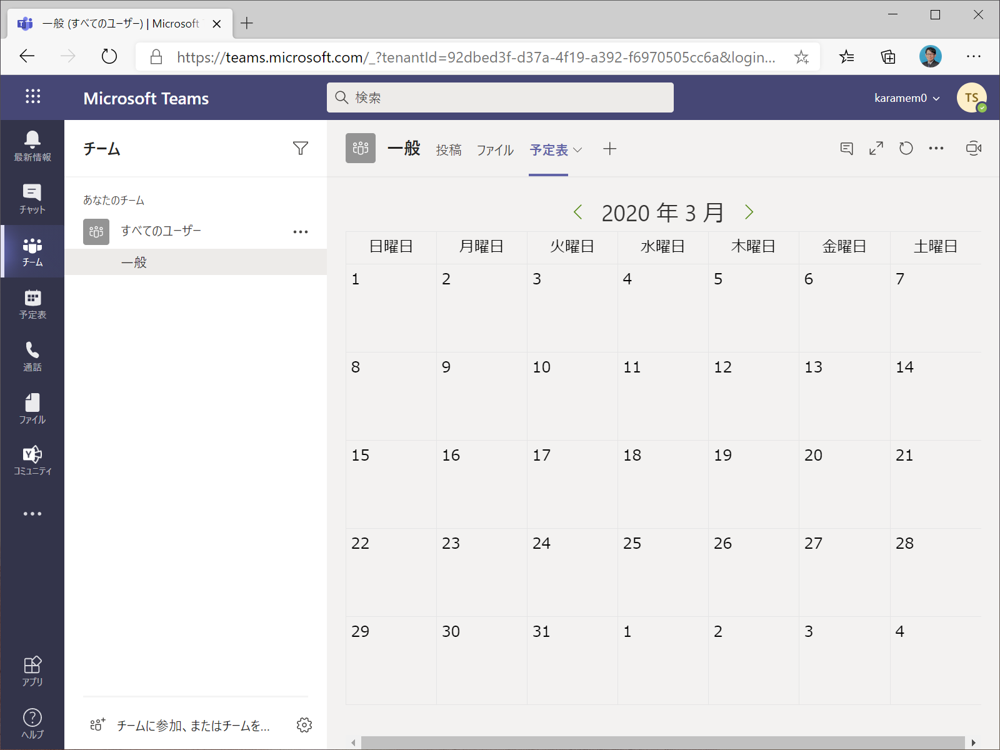

# SPFxCalendar

SPFxCalendar is a SharePoint webpart that displays event list items in the calendar view.

## Download

### [calendar.sppkg](https://github.com/karamem0/spfxcalendar/releases/download/v1.5.7/calendar.sppkg)

## Screenshot

### Default

### View an item

### Add an item

### Microsoft Teams tab

